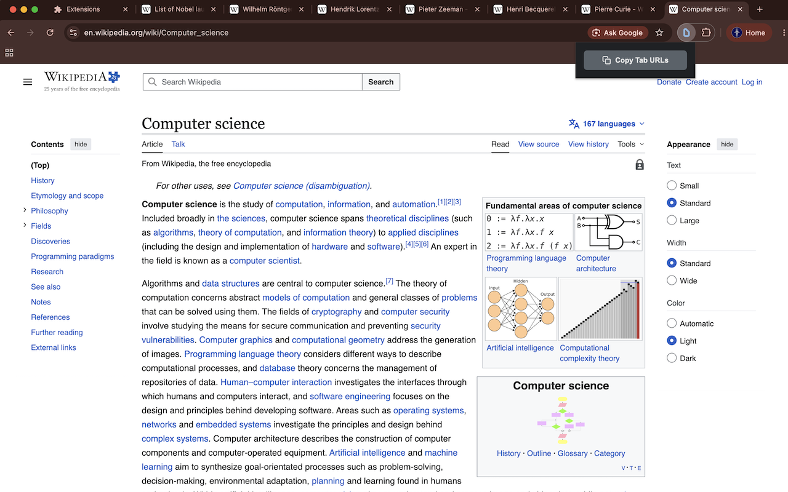

# Copy Tab URLs

This project is a Chrome extension.

Ever had a bunch of tabs you had open and wanted to send to someone else? Or
save in your own notes? Now you can save some time copying each link
one-by-one, and instead just hit a button to copy the URLs of all your selected
tabs to the clipboard.

On MacOS, you select multiple tabs by holding Command and clicking on the tabs
you want to select. On windows, you hold Control and click on them.

Chrome web store link: (TBD)

